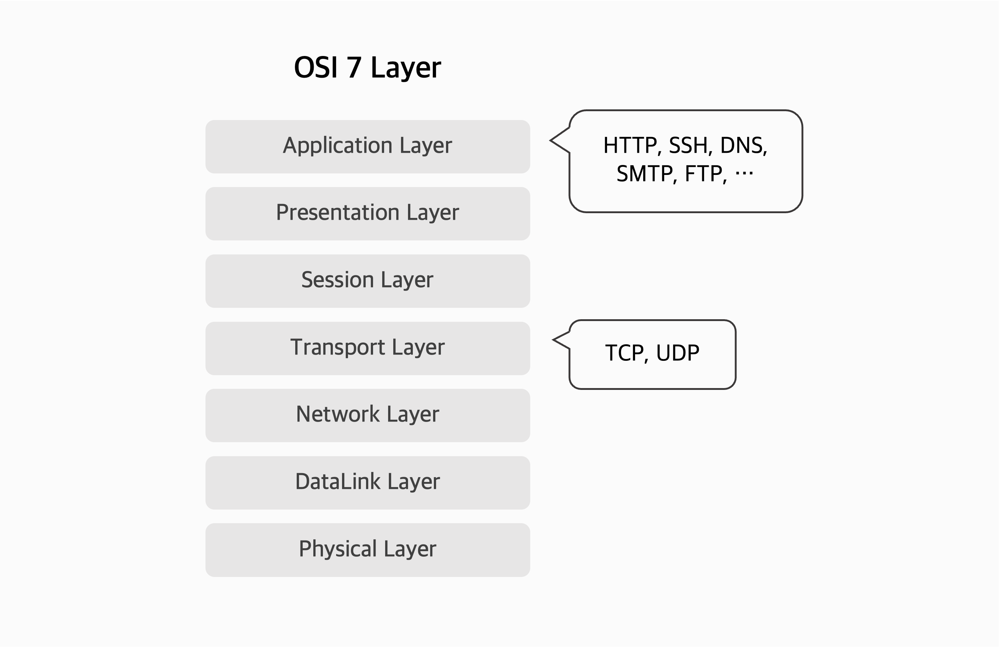
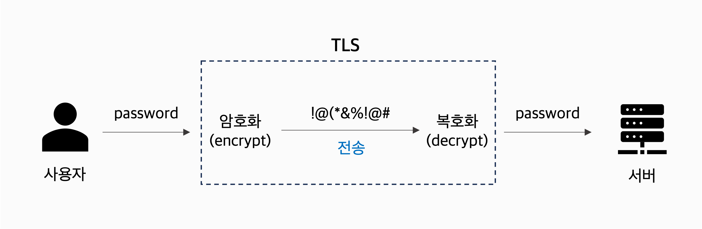
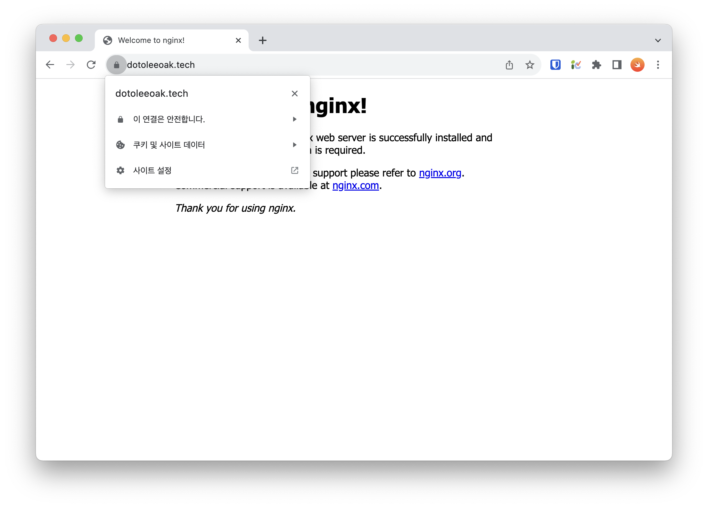

+++
author = "최재민"
title = "Certbot과 Docker로 무료 HTTPS 인증서 발급하기"
date = "2023-10-19"
description = "Certbot과 Let's Encrypt, 그리고 Docker로 HTTPS 인증서를 발급 받는 방법을 알아봅니다."
tags = ["infra"]
+++

이 글에서는 Certbot과 Let's Encrypt, 그리고 Docker로 무료 HTTPS 인증서를 발급 받는 방법을 알아봅니다. Certbot으로 인증서를 발급받는 방법을 설명하는 글은 많지만, 이 글에서는 Docker를 사용해서 조금 더 간편하게 인증서를 발급받아 볼 거예요.

## 개념 짚어보기 ✏️

인증서를 발급받기 전에, HTTPS의 개념과 Certbot, Let's Encrypt에 대해 간단히 설명할게요. 이미 아는 내용이라면 아래로 건너뛰어도 좋아요. ([여기로](#필요한-것))

### HTTPS의 동작 원리

HTTPS를 알려면 HTTP를 우선 알아야해요. HTTP는 OSI 7계층 중 가장 높은 7계층인 application layer에서 동작하는 protocol이예요. 요즘에는 웹의 대부분의 통신에 쓰인다고 해도 과언이 아닐 정도로 널리 쓰이는 protocol이죠. HTTP는 TCP를 기반으로 동작합니다. TCP는 4 계층인 transport layer에서 동작하는 protocol로 handshake를 기반으로 하여 데이터 유실을 막고 순서를 보장해요.

하지만 HTTP만으로는 암호화가 되지 않은 상태로 데이터가 전송되어서 여러 보안상의 취약점이 발생할 수 있어요. 예를 들어 사용자가 로그인을 위해 아이디와 비밀번호를 입력해서 서버에 전송할 때, 이 데이터가 암호화되지 않고 서버에 전송되면 중간에서 해커가 이를 가로채서 읽을 수 있죠. 이런 문제를 해결하기 위해 나온 것이 HTTPS에요. HTTPS는 HTTP와 달리 TCP와 application layer 사이에 위치하는 SSL/TLS를 사용해서 데이터를 암호화하고 전송해요.



SSL과 TLS 두 용어가 혼용되어서 쓰이곤 하는데, 사실 SSL은 구버전을 의미하고 TLS는 SSL의 개선 버전을 의미해요. 하지만 SSL과 TLS는 서로 호환되기 때문에 SSL과 TLS를 혼용해서 쓰는 경우가 많아요. 둘이 같은 것이라고 생각하셔도 좋아요.

TLS는 Transport Layer Security의 약자로, 이름 그대로 transport layer에서 동작하는 암호화 protocol이에요.



TLS는 대칭키와 비대칭키를 사용해요. 대칭키는 암호화와 복호화에 같은 키를 사용하는 방식이고, 비대칭키는 암호화와 복호화에 다른 키를 사용하는 방식이에요. 비대칭키를 사용하면 복호화키는 private key로 서버에 보관하고, 암호화키는 모든 사람에게 공개하는 public key로 사용해요. 이렇게 하면 암호화된 데이터를 복호화할 수 있는 사람은 private key를 가진 서버만 되기 때문에 보안이 높아져요. 하지만 비대칭키는 대칭키보다 암호화 속도가 느리기 때문에, TLS는 대칭키와 비대칭키를 함께 사용해요. 대칭키는 암호화 속도가 빠르기 때문에 데이터를 암호화할 때 대칭키를 사용하고, 대칭키를 공유할 때 비대칭키를 사용해요.

HTTPS, SSL, TLS에 대한 내용은 아래 영상에 잘 설명되어 있으니 참고해주세요.



### Certbot & Let's Encrypt

앞서 설명한 것처럼 HTTPS 사용을 위해선 암호화에 사용되는 public key와 복호화에 사용되는 private key가 필요해요. 이 키들은 보통 인증서 발급 기관(CA, Certificate Authority)을 통해 발급받아요. 인증서 발급 기관은 인증서를 발급받을 사람이 신원을 증명하면 인증서를 발급해주는 기관이에요. 인증서 발급 기관은 인증서를 발급받을 사람이 도메인의 소유자인지 확인하기 위해 도메인에 대한 소유권을 증명할 수 있는 여러 방법을 사용해요. 이런 인증서 발급 기관을 통해 발급받은 인증서를 사용하면, 사용자는 인증서 발급 기관이 발급한 인증서를 신뢰할 수 있어요.





Let's Encrypt가 바로 이 CA 중 하나예요. 보통의 CA와 달리 Let's Encrypt는 무료로 TLS 인증서를 발급해줘요. 보안상의 문제도 없고요! Certbot은 Let's Encrypt에서 TLS 인증서를 발급받기 위한 도구에요. Certbot 역시 무료로 사용할 수 있는 오픈소스 도구예요. 잘 사용하면 인증서 발급을 자동화할 수도 있어서 개발자들에게 편한 도구예요.

## 필요한 것

본격적으로 인증서를 발급받기 전에 아래 사항들을 확인해주세요.

- Docker를 설치해주세요.
- 서버에 도메인(example.com)이 등록되어 있어야 합니다.
- 아직 구동 중인 웹 서버가 없다는 가정하에 설명합니다.
- 이 글에서는 웹 서버로 Nginx를 사용해요.

## HTTPS 인증받기

### 1. Docker로 Certbot 실행하기

Docker로 Certbot을 실행해서 인증서를 발급받을 거예요. 아래 명령어를 입력해서 Certbot을 실행해주세요. `example.com`은 사용 중인 도메인으로 바꿔주세요.

```bash
docker run -it --rm \
  -v /etc/letsencrypt:/etc/letsencrypt \
  -v /var/lib/letsencrypt:/var/lib/letsencrypt \
  --network=host \
  certbot/certbot certonly
```

올바르게 실행되면 아래처럼 인증 옵션을 선택하라는 메시지가 나와요. 우리는 아직 웹서버를 실행하지 않았기 때문에 1번을 선택할 거예요.

```
How would you like to authenticate with the ACME CA?
- - - - - - - - - - - - - - - - - - - - - - - - - - - - - - - - - - - - - - - -
1: Runs an HTTP server locally which serves the necessary validation files under
the /.well-known/acme-challenge/ request path. Suitable if there is no HTTP
server already running. HTTP challenge only (wildcards not supported).
(standalone)
2: Saves the necessary validation files to a .well-known/acme-challenge/
directory within the nominated webroot path. A seperate HTTP server must be
running and serving files from the webroot path. HTTP challenge only (wildcards
not supported). (webroot)
- - - - - - - - - - - - - - - - - - - - - - - - - - - - - - - - - - - - - - - -
Select the appropriate number [1-2] then [enter] (press 'c' to cancel): 1
```

연락할 이메일을 입력하라는 메시지가 나와요. 이메일을 입력하고 엔터를 눌러주세요.

```
Enter email address (used for urgent renewal and security notices)
 (Enter 'c' to cancel): 1dotolee@gmail.com
```

이용 약관에 동의하라는 메시지가 나와요. `y`를 입력하고 엔터를 눌러주세요.

```
- - - - - - - - - - - - - - - - - - - - - - - - - - - - - - - - - - - - - - - -
Please read the Terms of Service at
https://letsencrypt.org/documents/LE-SA-v1.3-September-21-2022.pdf. You must
agree in order to register with the ACME server. Do you agree?
- - - - - - - - - - - - - - - - - - - - - - - - - - - - - - - - - - - - - - - -
(Y)es/(N)o: y
```

EFF에서 이메일을 받을지 묻는 메시지가 나와요. 원하는대로 `y` 또는 `n`을 입력하고 엔터를 눌러주세요.

```
- - - - - - - - - - - - - - - - - - - - - - - - - - - - - - - - - - - - - - - -
Would you be willing, once your first certificate is successfully issued, to
share your email address with the Electronic Frontier Foundation, a founding
partner of the Let's Encrypt project and the non-profit organization that
develops Certbot? We'd like to send you email about our work encrypting the web,
EFF news, campaigns, and ways to support digital freedom.
- - - - - - - - - - - - - - - - - - - - - - - - - - - - - - - - - - - - - - - -
(Y)es/(N)o: n
```

인증서를 발급받을 도메인을 입력하라는 메시지가 나와요. 여러 개의 도메인도 입력할 수 있어요. 입력 후 엔터를 눌러주세요.

```
Please enter the domain name(s) you would like on your certificate (comma and/or
space separated) (Enter 'c' to cancel): dotoleeoak.tech
```

발급이 완료되면 아래와 같은 메시지가 나와요.

```
Requesting a certificate for dotoleeoak.tech

Successfully received certificate.
Certificate is saved at: /etc/letsencrypt/live/dotoleeoak.tech/fullchain.pem
Key is saved at:         /etc/letsencrypt/live/dotoleeoak.tech/privkey.pem
This certificate expires on 2024-01-17.
These files will be updated when the certificate renews.

NEXT STEPS:
- The certificate will need to be renewed before it expires. Certbot can automatically renew the certificate in the background, but you may need to take steps to enable that functionality. See https://certbot.org/renewal-setup for instructions.

- - - - - - - - - - - - - - - - - - - - - - - - - - - - - - - - - - - - - - - -
If you like Certbot, please consider supporting our work by:
 * Donating to ISRG / Let's Encrypt:   https://letsencrypt.org/donate
 * Donating to EFF:                    https://eff.org/donate-le
- - - - - - - - - - - - - - - - - - - - - - - - - - - - - - - - - - - - - - - -
```

인증서는 `/etc/letsencrypt/live/<domain-name>`에 저장되어 있어요. Private key는 노출되면 안되기 때문에 이 폴더는 root 외에 접근할 수 없어요. 아래처럼 인증서 목록을 확인할 수 있어요.

```bash {hl_lines=[1]}
$ sudo ls /etc/letsencrypt/live/dotoleeoak.tech  # 도메인 이름에 맞게 바꿔주세요.
README  cert.pem  chain.pem  fullchain.pem  privkey.pem
```

### 2. Docker로 Nginx 실행하기

이제 웹 서버를 띄우고 HTTPS가 잘 작동하는지 확인해볼게요. 먼저 아래처럼 `nginx.conf` 파일을 만들어주세요. `example.com`은 사용 중인 도메인으로 바꿔주세요.

```nginx {hl_lines=[8,"15-17"],lineNumbersInTable=false,lineNos=true}
events {
  worker_connections 1024;
}

http {
  server {
    listen 80;
    server_name example.com;
    location / {
      return 301 https://$host$request_uri;
    }
  }
  server {
    listen 443 ssl;
    server_name example.com;
    ssl_certificate /etc/letsencrypt/live/example.com/fullchain.pem;
    ssl_certificate_key /etc/letsencrypt/live/example.com/privkey.pem;
    location / {
      root /usr/share/nginx/html;
    }
  }
}
```

아래처럼 `docker-compose.yml`을 작성해주세요. `/etc/letsencrypt` 폴더를 Nginx 컨테이너에 마운트해서 인증서를 사용할 수 있도록 했어요.

```yaml {lineNumbersInTable=false,lineNos=true}
version: "3"

services:
  nginx:
    container_name: nginx
    image: nginx
    ports:
      - "80:80"
      - "443:443"
    volumes:
      - ./nginx.conf:/etc/nginx/nginx.conf
      - /etc/letsencrypt:/etc/letsencrypt
```

그리고 Docker Compose로 컨테이너를 실행해주세요. 당연하지만 인증서를 발급받을 도메인에 해당하는 서버에서 실행해주세요!

```bash {hl_lines=[1]}
$ docker compose up -d
[+] Running 1/1
 ✔ Container nginx  Started
```

이제 도메인에 들어가보면 HTTPS로 접속할 수 있어요. 브라우저에서 `https://<domain-name>`에 접속해보세요. 아래처럼 인증서가 잘 적용된 것을 확인할 수 있어요.



### 번외: Caddy로 HTTPS 인증서 사용하기

지금까지 Certbot과 Nginx로 HTTPS 인증서를 발급받아 적용해보았어요. 절차가 복잡해보이고 조금 번거로운데, 웹 서버로 Nginx 대신 Caddy를 쓰면 자동으로 Let's Encrypt에서 인증서를 발급해줘요. 스꾸딩 팀에서도 Nginx 대신 Caddy를 사용하고 있어요.

Caddy 설정을 잠깐 보여드리면, 아래 설정으로 HTTPS 인증서를 발급받고 적용할 수 있어요. `example.com`은 사용 중인 도메인으로 바꾸면 돼요.

```Caddyfile
example.com {
    handle {
        root * /var/www/html
        try_files {path} /index.html
        file_server
    }
}
```

짧은 코드로 HTTPS를 사용할 수 있어서 편리하죠. `handle` block은 Nginx의 `server` block과 같은 역할이고, `example.com`처럼 도메인만 넣으면 자동으로 HTTPS 인증서를 발급받아 적용해줘요. 한번쯤 Nginx 대안으로 시도해보는 걸 추천드려요!
