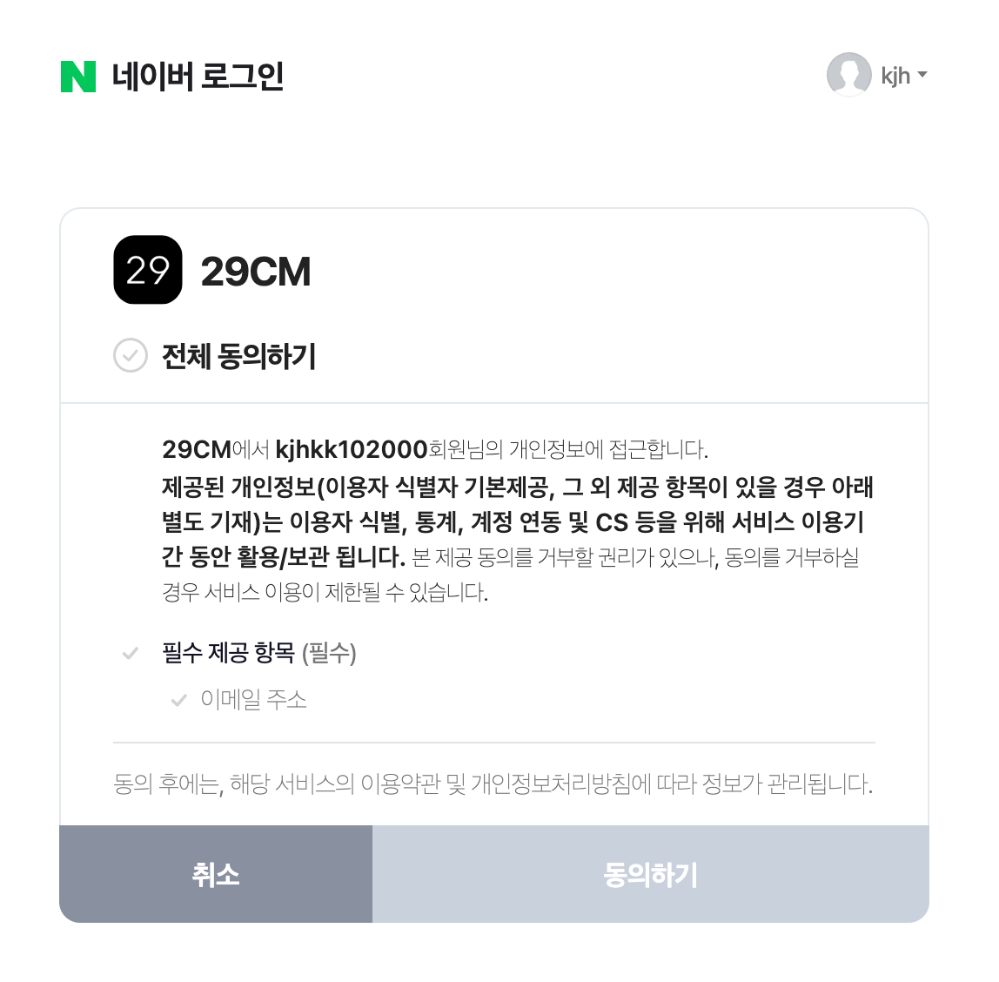
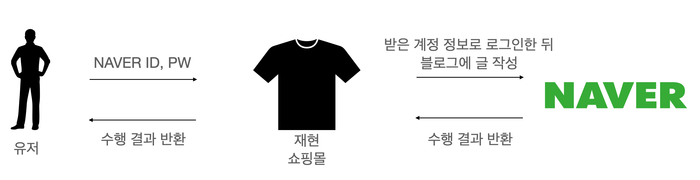
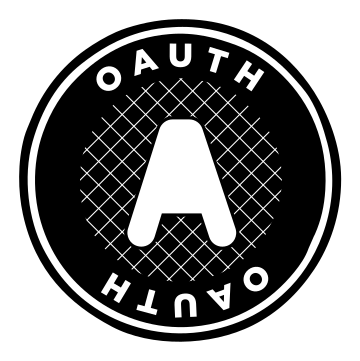
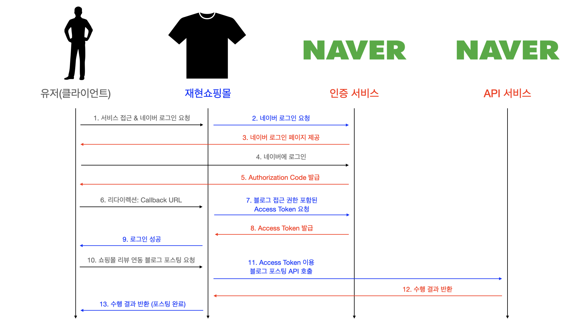

우리는 언제부턴가 많은 서비스들의 로그인 페이지에서 이런 로그인 버튼들을 보게 되었습니다.

분명히 예전에는 이런 게 없었는데, 하나둘 간편로그인을 지원하는 서비스들이 생기더니 지금은 아주 많은 웹사이트에서 간편로그인이 가능해졌습니다.

정말 편하죠. 카카오나 네이버, 페이스북은 엄청나게 많은 사람이 가입된 서비스이기 때문에 저 버튼 하나만 누르면 귀찮은 아이디와 비밀번호를 정하고 휴대폰번호를 인증하고.. 이런 과정들을 생략하고 내가 원래 사용하던 아이디로 로그인을 할 수 있으니까요. 마치 하나의 아이디로 여러 가지 서비스를 다 이용할 수 있는 것처럼 느껴집니다. 물론 깃허브도 개발자들이 많이 가입된 웹사이트이니 개발자들이 많이 사용하는 서비스에는 깃허브 로그인을 지원하는 경우가 많습니다.

간편로그인으로 로그인하다 보면 새롭게 가입한 웹사이트에서 내 이름, 이메일 등을 이미 알고있다는 사실을 발견하신 분들이 있으실 거예요. 그건 여러분이 이용한 간편로그인 제공자(카카오, 네이버, 깃허브 등)들이 여러분의 회원 정보를 제공했기 때문입니다. 위 사진에서도 29CM라는 쇼핑몰 서비스에서 네이버 로그인을 통해 이메일 주소를 제공받으려 하고 있습니다. 동의하고 가입하면 29CM에서 저 이메일을 활용한 기능들을 사용할 수 있게 될 거예요. 이외에도 네이버 계정을 활용한 기능(예를 들어 29CM에 가입된 네이버 계정의 블로그에 글쓰기)을 구현할 수도 있겠죠. 어떻게 이게 가능했을까요?

## OAuth의 등장

OAuth가 존재하지 않던 시절에도 위에서 설명한 기능들을 구현하고자 하는 시도는 물론 있었습니다. 그래서 사용한 방법의 하나는 연동을 원하는 서비스의 ID와 비밀번호를 직접 새롭게 가입하는 서비스에 그대로 제공하는 방법(!!!!!!)입니다. 제가 쇼핑몰 웹사이트를 하나 만들었고, 쇼핑몰에서 내가 작성한 리뷰를 네이버 블로그에 포스팅하는 기능을 만든다고 해볼게요. 쇼핑몰 서비스 위에서 네이버와 연동해 블로그에 글을 작성하고 싶다면, 쇼핑몰의 유저가 네이버 ID와 비밀번호를 직접 제공해야 했습니다.

이건 아주아주 매우매우 위험한 방법입니다. 이렇게 계정간 연동을 구현해버리면, 쇼핑몰의 데이터베이스가 공격받았을 때, 네이버 계정까지 같이 털리는 결과를 얻게 됩니다. 그런데 유저가 이 쇼핑몰만 이용할까요? 아니죠. 다른 많은 서비스들에 네이버 계정을 연동해놓았을 가능성이 높습니다. 이제 그 서비스들 중 하나라도 공격받아 데이터베이스가 탈취된다면 네이버 계정이 털리게 됩니다. 심지어 재현쇼핑몰의 관리자인 제가 마음만 먹으면 유저들의 네이버 계정으로 로그인해 나쁜 짓을 할 수도 있겠죠.

이 문제를 해결하기 위해서 네이버에서 쇼핑몰쪽에 **정해진 만큼의 권한**만을 주도록 할 수 있습니다. ID와 비밀번호를 모두 받는 방법 대신 이메일 접근 권한이 필요하면 이메일 권한만, 블로그 접근 권한이 필요하면 그 권한만 열어줄 수 있는 방법이 있다면 위에서 설명한 위험한 상황은 발생하지 않을 거예요.

**OAuth**가 여기서 등장합니다(사실 구글의 AuthSub, 야후의 BBAuth 등이 있었지만 OAuth가 최초로 인증방식의 표준이 되었어요). OAuth는 다양한 플랫폼(네이버 등)의 특정한 사용자 데이터에 접근하기 위해 제3자 클라이언트(여기서는 재현쇼핑몰)가 사용자의 접근 권한을 위임받을 수 있는 프로토콜입니다. OAuth를 이용하면 쇼핑몰에 유저의 네이버 ID와 비밀번호를 전달하지 않고도 원하는 네이버 서비스에 접근할 수 있습니다. OAuth는 최초 버전인 1.0 이후 1.0a 버전을 거쳐 현재 2.0 버전이 사용되고 있어요.

## OAuth 2.0 작동방식

OAuth가 어떻게 등장하게 되었는지 알아보았으니, 이제 어떻게 작동하는지 간단히 알아봅시다. 아까와 똑같이 쇼핑몰 리뷰를 네이버 블로그에 포스팅하는 기능을 만든다고 해 볼게요. 그런데 이번에는 OAuth의 작동방법을 따라 네이버 권한 일부(블로그 접근 권한)만을 쇼핑몰쪽에 위임합니다.

조금 복잡해 보이지만, ID와 비밀번호를 직접 쇼핑몰쪽에 전달했던 예전 방식과 차이가 보일 거예요. 유저는 네이버 계정을 쇼핑몰에 전달하지 않고, 직접 네이버 인증 서비스를 통해 로그인합니다. 쇼핑몰에서는 유저가 로그인 후 네이버로부터 발급받은 Authorization Code를 이용해 블로그 접근 권한이 있는 Access Token을 발급받을 수 있습니다. 그림에 표시된 순서대로 조금 더 자세히 설명할게요.

**OAuth 이용 네이버 연동 과정**

- (1) 클라이언트가 재현쇼핑몰을 통한 네이버 서비스 연동을 위해 로그인을 요청합니다.
- (2) 쇼핑몰 서버에서 네이버 인증서비스에 로그인을 요청합니다.
- (3) 네이버 인증 서비스에서 클라이언트에 네이버 로그인 페이지를 제공합니다.
- (4) 네이버에 로그인합니다. (이 때 네이버 ID, 비밀번호 입력)
- (5-6) 네이버 인증 서비스에서 클라이언트로 **Authorization Code**를 발급하고, 클라이언트는 미리 정해둔 Callback URL로 리다이렉션됩니다.
- (7-9) 쇼핑몰 서버에서 Callback URL을 통해 전달된 Authorization Code를 이용해 네이버 인증 서비스로 블로그 접근 권한이 담긴 **Access Token**을 요청하고, 문제가 없다면 네이버 인증 서비스에서 쇼핑몰로 Access Token이 발급됩니다(⇒ 네이버 계정 권한 일부 쇼핑몰로 위임). 이 과정까지 문제가 없다면 유저는 네이버 간편로그인에 성공하고, 이제 쇼핑몰 리뷰를 네이버 블로그에 포스팅하는 기능을 사용할 수 있는 상태입니다.
- (10) 유저가 쇼핑몰 리뷰 네이버 블로그 포스팅을 요청합니다.
- (11) 쇼핑몰 서버는 가지고 있던 **Access Token**을 이용해 네이버 API 서비스에서 **블로그 포스팅 API**를 호출합니다.
- (12-13) API 호출 결과가 반환되고 정상적인 경우 포스팅이 완료됩니다.

위의 과정을 거쳐서 유저는 네이버 계정을 직접 쇼핑몰에 전달할 필요 없이 네이버 연동 기능을 이용할 수 있게 되었습니다.

## 또 다른 장점

보안적으로 안전하다는 장점 이외에도 OAuth 사용으로 따라오는 장점들이 많아 지금은 많은 서비스들에서 OAuth를 이용한 계정 연동을 지원하고 있어요.

**OAuth를 사용해 간편로그인과 계정 연동 기능을 구현하면 이런 이점들을 얻을 수 있어요:**

- 보안이 향상돼요: 위에서 설명한 것과 동일하게 필요한 권한만을 위임해 보안을 향상시킬 수 있어요.
- 유저 편의성이 향상돼요: OAuth로 간편로그인을 구현할 수 있기 때문에 유저들이 따로 새로운 서비스만을 위한 계정을 생성하지 않고 원래 쓰던 계정으로 로그인해 바로 새로운 서비스를 이용할 수 있어요.
- 다양한 통합이 가능해요: 소셜 연동의 종류에 네이버만 있는게 아니죠. 하나의 서비스에서 네이버, 카카오, 구글, 깃허브 등 여러 플랫폼을 연동하도록 할 수 있어요.

## 마무리

지금까지 OAuth가 어떻게 등장하게 되었는지, 어떻게 동작하는지, 왜 이렇게 많은 서비스들이 OAuth를 활용한 서비스를 제공하는지에 대해 알아보았습니다.
최근 스꾸딩 팀에서도 OAuth를 활용한 간편로그인을 개발중에 있어요. 지금은 간편로그인 기능만 개발중이지만 추후에 소셜 계정과 연동해 다양한 재미있는 기능들이 추가될지도..??

### 참고자료

https://en.wikipedia.org/wiki/OAuth

[https://developers.naver.com/docs/login/devguide/devguide.md#네이버 로그인-개발가이드](https://developers.naver.com/docs/login/devguide/devguide.md#%EB%84%A4%EC%9D%B4%EB%B2%84%20%EB%A1%9C%EA%B7%B8%EC%9D%B8-%EA%B0%9C%EB%B0%9C%EA%B0%80%EC%9D%B4%EB%93%9C)

https://gdtbgl93.tistory.com/178

https://hudi.blog/oauth-2.0/
