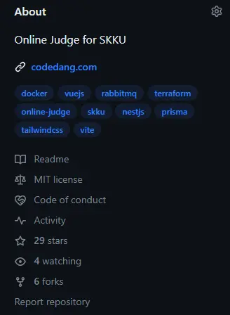

+++
author = "김일건"
title = "오픈소스, 라이선스, 분쟁... 그리고 포크 파티(?)"
date = "2023-11-09"
description = "OpenSource와 License, 그리고 이로 인한 기업간의 분쟁에 대해 가볍게 알아볼까요!"
tags = ["infra"]
+++

이번 주제는 조금 덜 기술적인 주제입니다!  
(열심히 코드보다가 머리아플 때 편하게 읽어보면 좋지 않을까 싶어요ㅎㅎ)  
오픈소스에 대해 간단하게 알아보고, License와 관련된 ~~어른~~개발자들의 세계에 대해 살펴보고자 합니다.

## Terraform은 더이상 오픈소스가 아닙니다!(?)

지금 우리 Infra 팀은 코드당을 배포하는 과정에서 [**Teraform**](https://www.terraform.io/)이라는 툴을 사용하고 있습니다. 간단하게 설명하자면, Terraform은 HashiCorp라는 기업에서 제작한 **오픈소스(였던)** IaC tool입니다.  
...? "였던"이라구요? 네, 맞습니다. 최근에 Terraform의 라이선스에 변화가 있었습니다. 코드당에 Terraform을 도입할 때 까지만 해도 Terraform은 오픈소스 SW였지만, 지난 8월 Hashcorp가 라이선스를 변경하면서([MPL-2.0](#mpl-20mozilla-public-license-20) -> [BUSL-1.1](#busl-11business-source-license-11)) 더 이상 오픈소스가 아니게 되었다고 합니다.



자, 그럼 일단 가장 먼저 드는 생각이 있죠... 우리 혹시 Terraform 못쓰는건가?😮 다른 툴로 바꿔야 하나..???(살려줘ㅠㅠ🤮) 다행히도 아니더군요.

> 띠용?!? 오픈소스가 아닌데도 써도 괜찮다구요??? 왜죠???

[HashiCorp의 발표자료](https://www.hashicorp.com/blog/hashicorp-adopts-business-source-license)를 조금 찾아봤습니다.

> End users can continue to copy, modify, and redistribute the code for all non-commercial and commercial use, except where providing a competitive offering to HashiCorp.

다행히 우리 같은 대부분의 사용자들은 계속 사용할 수 있다고 명시되어 있었습니다. 그런데 조금 이상한 부분들이 눈에 띄더군요.👀 라이선스 변경 이후에도 Github에 소스코드도 계속 공개할 것이고, 일반 사용자들의 기여도 여전히 가능하며, 상업적으로도 이용이 가능하다고 명시가 되어있었습니다. 오직 "providing a competitive offering to HashiCorp"인 경우에만 HashiCorp의 허가가 필요하다고 적혀있었구요.  
_(물론 개발자들 사이에서는 "competitive offering"의 범위가 상당히 모호하다는 입장이 있는 것 같기도 합니다. 그럼에도 불구하고 대부분의 사용자들은 지속적으로 사용할 수 있어보이네요!)_  
아니, 분명히 오픈소스가 아니라고 했던 것 같은데...?😵‍💫 (이 부분에서 혼란이 왔습니다.) 그!래!서! 오픈소스에 대해서 조금 알아봤습니다.

## 오픈소스란..?

오픈소스(오픈소스 소프트웨어)가 뭘까요? ([Red-hat의 article](https://www.redhat.com/ko/topics/open-source/what-is-open-source)를 참고했습니다!)  
오픈소스란 원래 오픈소스 소프트웨어(Open Source Software, OSS)를 뜻하는 용어로, 공개적으로 액세스할 수 있게 설계되어 누구나 자유롭게 확인, 수정, 배포할 수 있는 코드를 의미합니다.  
이런 오픈소스 소프트웨어들은 특별한 라이선스들을 통해 공개되는데, 오픈소스 라이선스들에는 GPL, LGPL, MPL, Apache License, MIT 등이 있습니다. 오픈소스라고 다 같은 정책을 가지고 있는 게 아니란거죠!! 그리고 이런 라이선스들은 [OSI](https://opensource.org/licenses/) 라는 비영리단체에서 인증 및 관리를 하고 있다고 합니다.
(우리 코드당은 MIT license가 적용되어있군요! )

즉, 위에서 말했던 Terraform의 경우에는 MPL-2.0이라는 **"오픈소스"** 라이선스를 적용하다가, BSL v1.1이라는 라이선스로 변경했기 때문에 더 이상 오픈소스가 아니게 된 것이죠! _(그렇지만 너무 오픈소스 같지 않은가요...?)_

자, 그럼 다시 돌아와서 왜 HashiCorp는 라이선스 변경을 추진 했을까요?

> However, there are other vendors who take advantage of pure OSS models, and the community work on OSS projects, for their own commercial goals, without providing material contributions back. We don’t believe this is in the spirit of open source.

(의역) 상업적 목적으로 오픈소스 소프트웨어를 이용하면서 오픈소스 프로젝트에 기여하지 않는, 오픈소스의 정신에 부합하지 않는 사람들을 막기 위해서 변경했다고 합니다. 이와 관련해서 수많은 개발자들이 많은 의견을 내고 있는 것으로 알고 있습니다. 라이선스 변경에 반발한 개발자들이 Terraform의 포크버전인 [OpenTofu](https://opentofu.org/)를 만들기도 했더라구요. ~~(사실 쫌 충격이긴 했습니다...ㅋㅋㅋㅋ 무서운 어른들의 세계...ㄷㄷ)~~

더 이야기하면 누가 잘했느냐, 못했느냐에 대한 이야기를 하게 될 것 같으니 각설하고, 이전에 있었던 다른 기업(프로그램)들의 라이선스 변경과 관련된 이야기들도 간단하게 알아볼까요!

## MongoDB vs AWS

우리가 많이 들어본 MongoDB 역시 2018년 라이선스 변경([AGPL-3.0](#agpl-30affero-gnu-public-license-30) -> [SSPL-1.0](#sspl-10server-side-public-license-v1))이 있었습니다. 먼저 왜 라이선스를 변경했는지부터 알아볼까요?

> The reality, however, is that once an open source project becomes interesting, it is too easy for large cloud vendors to capture all the value but contribute nothing back to the community.
>  https://www.mongodb.com/licensing/server-side-public-license/faq

즉, 오픈소스 소프트웨어를 개발하지 않았음에도 클라우드 제공 업체가 이를 서비스해서 수익을 얻고, 오픈소스 소프트웨어를 개발한 커뮤니티에는 기여하지 않는다는 점을 문제로 지적하며 라이선스 변경을 하게 된 것이라고 설명하고 있습니다. 물론, 여기서 말하는 "클라우드 제공 업체"는 AWS를 겨냥한 것이었죠.
그래서 MongoDB가 SSPL이라는 라이선스를 새로 만들었고, 이 라이선스에는 MongoDB를 서비스하려는 경우 관련된 모든 소스 코드를 공개해야 한다는 조건을 추가로 내걸었습니다. 실질적으로 AWS가 SSPL 라이선스가 적용된 버전의 MongoDB를 사용할 수 없도록 막아버린 것이죠. (2021년 이후 부터 AWS와 MongoDB가 협력하는 것을 보니 친해진 것 같기는 합니다)  
그러나 이 경우에도 오픈소스라는 정체성을 전부 버린 것은 아니었습니다. SSPL의 기반에는 AGPL이라는 오픈소스 라이선스가 있었으니까요. 실제로 MongoDB가 SSPL 라이선스를 OSI에게 승인받기 위해서 많은 노력을 한 것으로 알고 있습니다. 물론 실패했지만요.

## ElasticSearch vs AWS

이번에는 2021년 ElasticSearch의 라이선스가 ([Apache v2.0](#apache-20apache-license-v20) -> [SSPL](#sspl-10server-side-public-license-v1) 또는 Elastic License v2.0 ([ELv2](#elv2-elastic-license-v20))) 변경되었습니다. 변경 이유는 MongoDB와 상당히 유사했습니다.

> ... 일부 클라우드 서비스 제공자는 재공헌 없이 오픈 소스 제품을 활용해 이를 서비스로 제공합니다 ...
> https://www.elastic.co/kr/blog/licensing-change

ELv2 역시 마찬가지로 AWS가 ElasticSearch를 사용하지 못하도록 라이선스를 변경하였고, 결국 AWS에서는 기존에 서비스하고 있던 Elastic Search를 지속하기 위해 Elastic Search 7.1을 Fork하여 OpenSearch라고 명명하여 서비스를 유지하고 있습니다.

## 마무리...

흐음... 알아보면 알아볼수록 쉽지 않은 문제라는 생각이 들었습니다.
이렇게 클라우드가 발전하면서 SaaS 기업들과 오픈소스 소프트웨어간에 발생하는 충돌문제는 필연적으로 생길 수 밖에 없을 겁니다. 아니, 오픈소스 생태계가 커지는 한 이전보다 더 크고 심각한 문제들이 수면위로 올라오겠죠. 특히 라이선스와 관련된 문제는 기업의 생사에도 영향을 미칠만큼 심각한 문제이니 말입니다.  
Elastic와 MongoDB의 사례를 보면서 오픈소스인듯 오픈소스가 아닌 (오픈소스 같은...) 방식으로 제공되는 소프트웨어들이 점점 많아지지 않을까 생각이 들더군요. 진화된 오픈소스의 형태라고나 할까요? 앞으로 오픈소스 생태계가 조금은 변화하게 되지 않을까 싶기도 하구요.

사실 이 글을 작성하면서 인터넷상의 많은 (외국)개발자들의 의견을 접할 수 있었습니다. 상당히 흥미롭더군요... ~~(영어는 어렵구요)~~ 앞으로 우리들이 몸담게 될 개발 생태계 안에서 이런 이슈들에 대해 생각해 보는 과정이 이 세계를 조금 더 넓은 시각으로 바라보고, 이해할 수 있는 기회가 되겠다! 싶어서 이런 주제를 가져와봤습니다.  
색다른 정보를 얻을 수 있었던 좋은 기회가 되었으면 좋겠네요!  
읽어주셔서 감사합니다!!

## 라이선스 간단 정리

모든 내용을 명시하지는 않았고, 주요 특징만 적었으니, 정확한 내용은 직접 찾아보셔야합니다!!!

### MPL-2.0(Mozilla Public License 2.0)

- 오픈소스 라이선스 ⭕ (OSi 승인)
- 사용하거나 수정한 MPL 소프트웨어는 공개 및 원저작자에게 수정한 부분을 고지
- 실행파일은 독점 라이선스로 배포 가능

### BUSL-1.1(Business Source License 1.1)

- 오픈소스 라이선스 ❌
- 상업적 목적이 아닌 경우 무료로 사용 가능하지만,
- 상업적 목적을 가지는 경우 라이선스 비용 지불

### AGPL-3.0(Affero GNU Public License 3.0)

- 오픈소스 라이선스 ⭕ (OSi 승인)
- AGPL은 기존 GPL 라이선스에서 네트워크로 서비스를 연결하는 경우가 추가된 라이선스
- SW를 수정없이 사용하는 경우에는 해당 오픈소스에 대해서만 공개 의무가 발행되지만,
- SW를 수정해서 사용하는 경우에는 전체 소스코드 공개 의무가 발행됨.

### SSPL-1.0(Server Side Public License v1)

- 오픈소스 라이선스 ❌
- AGPL-3.0 라이선스를 기반으로 하되, 서비스의 일부로 SSPL SW를 제공하는 경우 라이선스 의무가 발생

### Apache-2.0(Apache License v2.0)

- 오픈소스 라이선스 ⭕ (OSi 승인)
- 소스 코드 공개의 의무가 없고, 2차 라이선스와 변형물의 특허 출원이 가능
- 소스 코드 수정 시에는 외부에 사실을 밝여야함
- 또한, 라이선스 적용 시 아파치 재단의 이름과 라이선스의 내용을 명시해야함

### ELv2 (Elastic License v2.0)

- 오픈소스 라이선스 ❌
- 오픈서스 라이선스가 가지는 거의 모든 자유를 보장하지만, 다음 2가지는 제한함.
- 제 3자에게 호스팅 등의 서비스로 SW 제공 불가
- 라이선스 키 변경 금지
