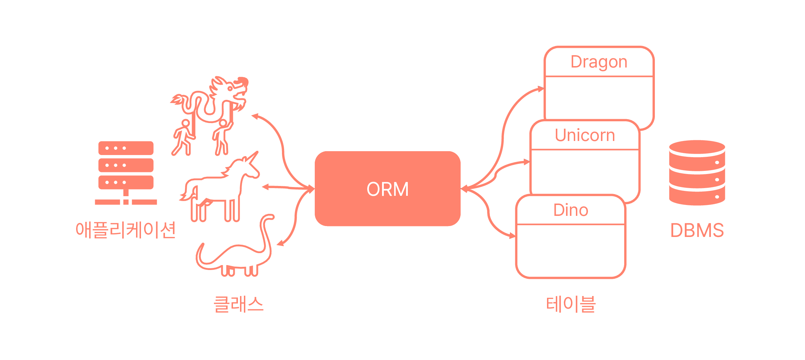
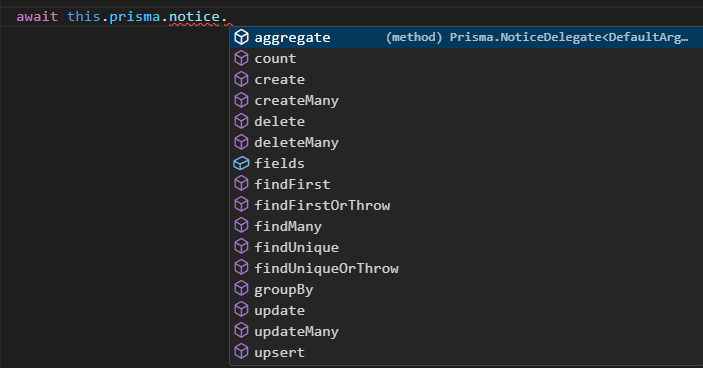

+++
author = "임소리"
title = "The Curious Case of Prisma"
date = "2023-11-02"
description = "ORM의 개념과 Prisma가 다른 ORM과 어떤 차이점을 갖는지를 알아봅니다."
tags = ["backend", "database"]
+++

스꾸딩 백엔드 팀에서는 [Prisma](https://www.prisma.io/)를 활용해서 데이터베이스에 접근하고 있어요. 저희처럼 Prisma를 사용해보았다면, 원하는 데이터의 구조와 조건을 설정하기만 하면 데이터를 요청할 수 있다는 걸 아실 거예요. 심지어는 여러 테이블을 합쳐야 요청하려는 구조를 만들 수 있다고 해도요! 어라, 그럼 그 유명한 JOIN은 어디로 간 걸까요? Prisma에서는 JOIN이 필요하지 않은 걸까요?

이 질문을 하는 건, 팀원이 같은 물음을 던졌을 때 막연히 "내부적으로는 JOIN으로 처리하지 않을까?"라고 대답했던 기억이 있기 때문이에요. 그래서 여기서는 Prisma에는 정말 JOIN이 없는지, 없다면 왜인지를 확실히 알아보려고 해요. (🚨스포일러 주의: _정말 없었답니다!_ ) 하지만 글에는 ORM이 무엇인지부터, Prisma가 다른 ORM과 비교해서 어떤 차이점을 갖는지도 함께 담아보았어요. JOIN 문제를 차치하더라도 Prisma는 꽤 독특한 ORM이거든요. 그럼 시작해볼까요? 참, ORM과 Prisma에 대해 잘 알고 있다면 바로 [여기](#prisma에는-join이-없나요)로 넘어가도 좋아요.

## ORM이 무엇인가요?

ORM(Object Relational Mapping; 객체 관계형 연결)은 말 그대로, 객체와 관계형 데이터베이스를 연결하고자 하는 아이디어를 말해요. 데이터베이스의 테이블과 1:1로 연결되는 클래스(객체)를 정의하면, 클래스를 통해 간접적으로 테이블을 조작할 수 있겠다는 생각에서 출발했어요. 간단하게 말하면 OOP를 확장해서 데이터베이스까지 추상화하는 거죠!

예를 들어, 아래 그림처럼 유니콘 테이블이 있다면, 이에 대응하는 유니콘 클래스를 애플리케이션에 만들어요. 유니콘 클래스에는 유니콘의 CRUD에 필요한 정보나 operation이 모두 정의돼 있어서, 클래스를 사용하는 사람은 구현부를 알지 못해도 괜찮아요. 하지만 상속을 적절히 활용한다고 해도, 모든 테이블에 대해 클래스를 구현하기란 상당히 골치 아픈 일일 거예요.



물론 방법이 있습니다, ORM을 쓰면 돼요! ORM은 이러한 개념을 실제로 구현해둔 Prisma와 같은 서비스를 통칭하는 단어이기도 하거든요. ORM은 개발자가 정의한 객체와 객체 간의 관계를 보고 SQL 쿼리를 자동으로 생성하는 API를 제공해주기 때문에, SQL을 잘 알지 못하는 개발자도 쉽게 데이터베이스를 이용할 수 있어요. 코드에 직접적인 SQL 쿼리가 삽입되지 않는 만큼, 데이터베이스에 대한 의존성을 줄일 수 있다는 장점도 있고요.

### Active Record vs. Data Mapper

ORM은 어떻게 만들어질까요? 일반적인 패턴으로는 크게 Active Record 패턴과 Data Mapper 패턴이 있어요. TypeORM 같은 ORM은 양쪽을 모두 지원해요.

Active Record 패턴은 애플리케이션 데이터(모델)와 데이터베이스를 동치시키는 방법이에요. 이 패턴에서 클래스는 테이블과 같고, 클래스의 필드는 테이블의 칼럼과 같고, 인스턴스는 레코드와 같아요. 또, 클래스에는 필드뿐만 아니라 접근/조작 로직까지 전부 들어 있어서, 테이블과 관련된 모든 operation을 클래스 하나로 처리할 수 있어요. 하지만 이는 곧 데이터베이스에 대한 의존성이 높아진다는 의미이기도 해요. 만약 테이블의 칼럼명이 바뀌기라도 하면 코드에서 해당 칼럼명의 occurence를 모두 찾아 수정해야겠죠.

Data Mapper 패턴은 Active Record 패턴과 다르게, 모델과 테이터베이스가 분리되어 있어요. 이 패턴을 사용하려면 각 테이블에 대해서 두 가지 종류의 클래스를 정의해야 해요.

- 엔티티 클래스: 모델을 정의하는 클래스예요. 테이블과 구조나 정보가 똑같지 않더라도 매퍼 클래스에서 해결해줄 테니 문제 없어요.
- 매퍼 클래스: 엔티티 클래스와 실제 데이터베이스를 연결하는 로직을 정의해요.

어떤 패턴을 적용하든, 데이터베이스에 접근하는 일반적인 로직은 ORM 서비스에서 제공해줄 거예요. Active Record ORM에는 필수적인 로직을 미리 구현해둔 템플릿 클래스가 있을 거고, Data Mapper ORM은 개발자가 정의한 엔티티에 대해 매퍼를 만들어주겠죠! 이해가 잘 안 된다면 [TypeORM 사용 예시](https://typeorm.io/active-record-data-mapper)를 참고해주세요.

### 진퇴양난

로직은 ORM이 맡아준다니, 우리가 우선적으로 신경 써야 할 건 모델을 어떻게 정의하고 관리하느냐겠죠! 앞서 살펴보았듯이 Active Record 패턴은 모델을 데이터베이스와 분리할 수 없다는 단점이 있었어요. Data Mapper 패턴은 이 문제를 해결하여 조금 더 유연하게 모델을 관리할 수 있지만, 여전히 테이블마다 엔티티 클래스가 만들어지기 때문에 변화를 트래킹하기는 조금 어려울 수 있어요. 특히 DBA와 백엔드 팀이 분리되어 있다면요.

## Prisma와 스키마

Prisma도 Data Mapper ORM이지만 다른 ORM과는 본질적인 차이가 있어요. 바로 자체 스키마로 모든 모델을 생성하고 관리한다는 거죠! 아래는 스꾸딩에서 사용하는 Prisma 스키마의 일부인데, 문법이 간단해서 의미를 쉽게 해석할 수 있을 거예요.

```prisma
model Notice {
  id          Int      @id @default(autoincrement())
  createdBy   User     @relation(fields: [createdById], references: [id], onDelete: Restrict)
  createdById Int      @map("created_by_id")
  group       Group    @relation(fields: [groupId], references: [id])
  groupId     Int      @map("group_id")
  title       String
  content     String
  isVisible   Boolean  @default(true)  @map("is_visible")
  isFixed     Boolean  @default(false) @map("is_fixed")
  createTime  DateTime @default(now()) @map("create_time")
  updateTime  DateTime @updatedAt      @map("update_time")

  @@map("notice")
}
```

Prisma는 단 하나의 스키마 파일을 바탕으로 데이터베이스 스키마와 모델 클래스, 그리고 Prisma Client를 모두 생성해요. Prisma Client란, 모든 모델에 대한 매퍼 로직을 담고 있는 객체를 말해요. 개발자는 생성된 Prisma Client를 통해 데이터베이스에 접근할 수 있어요. Prisma는 Client 생성 및 migration 과정에 스키마를 도입해서, 애플리케이션 데이터와 데이터베이스 스키마가 바로 동기화될 수 있도록 했어요.



## Prisma에는 JOIN이 없나요?

이제 본론으로 들어가볼까요? Prisma에서는 스키마를 바탕으로 자동으로 생성되는 Prisma Client의 메소드를 활용해서 데이터베이스에 접근한다고 했어요. 다음은 아까 보았던 Notice 모델에 사용할 수 있는 메소드 목록이에요. 보시다시피 JOIN은 존재하지 않습니다. 게다가 서브쿼리도 없어요.



그렇다면, SQL에서처럼 JOIN이나 서브쿼리와 같은 관계 쿼리를 쓰고 싶을 때는 어떻게 해야 할까요?

```ts
await this.prisma.notice.findMany({
  include: {
    group: true,
  },
});
```

위 코드는 Prisma Client(`prisma`)를 이용해 데이터베이스에서 모든 notice 레코드를 가져오는 코드예요. `include` 옵션을 활용하면 JOIN을 사용할 때처럼 notice 레코드마다 연관된 group의 정보를 같이 받아올 수 있어요. 모든 정보가 아니라 특정 칼럼만 가져오고 싶다면 아래처럼 `select` 옵션을 이용하는 방법도 있고요.

```ts
const notices: Array<{
  id: number;
  title: string;
  group: {
    groupNmae: string;
  };
}> = await this.prisma.notice.findMany({
  select: {
    id: true,
    title: true,
    group: {
      select: {
        groupName: true,
      },
    },
  },
});
```

### Prisma에는 JOIN이 정말 없나요?

개발자가 사용할 수 있는 메소드에 JOIN이 없다고 해서, Prisma에 정말로 JOIN이 없을 거라고 단정할 수는 없죠. 앞서 살펴본 관계 쿼리가 SQL문으로 변환될 때 JOIN 구문을 사용하는 건 아닐까요? 요청하려는 데이터의 구조를 nested structure로 표현한다는 걸 생각하면, 직관적으로 서브쿼리로 요청을 처리할 가능성도 꽤나 높아 보이고요. 만약 관계 쿼리가 JOIN으로 처리된다면, 위에서 `select` 옵션을 사용해서 만든 쿼리는 다음과 같이 변환될 거예요.

```sql
SELECT "Notice"."id", "Notice"."title", "Group"."groupName" FROM "Notice"
  LEFT JOIN "Group" ON "Notice"."groupId" = "Group"."id";
```

이번엔 직접 관계 쿼리를 호출하고 생성된 SQL문을 로깅한 결과를 확인해볼까요? 실제로는 JOIN도 아니고, 서브쿼리도 아니고, 단순히 `SELECT` 쿼리를 두 번 보낸다는 걸 알 수 있어요!(😱)

```sql
SELECT "Notice"."id", "Notice"."title", "Notice"."groupId" FROM "Notice"
  WHERE 1=1 OFFSET $1;
SELECT "Group"."id", "Group"."groupName" FROM "Group"
  WHERE "Group"."id" IN ($1,$2,$3) OFFSET $4;
```

### 네, Prisma에는 JOIN이 없습니다!

여러분이 Prisma로 관계 쿼리를 작성하면, Prisma는 데이터베이스가 관계를 계산하게 두지 않을 거예요. 대신에 요청된 관계 쿼리를 테이블 단위로 쪼개서 여러 개의 SELECT 구문을 생성하겠죠. 모든 SELECT의 결과를 한데 모아, 마치 JOIN을 수행한 것처럼 보이도록 에뮬레이션하는 작업은 Prisma의 코어 엔진이 담당하는 일이에요.

아까 보았던 Prisma 스키마를 잠깐 다시 볼까요? 사실 스키마에서 `@relation` 키워드가 붙은 칼럼은 데이터베이스 스키마에 포함되지 않아요. 그런데도 관계 칼럼을 정의하는 이유가 바로 여기에 있어요. 이 칼럼이 있어야 개발자가 Prisma Client에 타입 오류가 없음이 확실한 조건을 입력할 수 있고, 코어 엔진도 데이터베이스로부터 받은 결과를 재구성할 수 있거든요.

```prisma
model Notice {
  id          Int      @id @default(autoincrement())
  createdBy   User     @relation(fields: [createdById], references: [id], onDelete: Restrict)
  createdById Int      @map("created_by_id")
  ...
}
```

이제 Prisma에 정말로 JOIN이 없다는 걸 알았어요. 하지만 Prisma는 JOIN을 사용하지 않아도 괜찮은 걸까요? SELECT를 여러 번 전송하는 것이, JOIN이나 서브쿼리가 섞인 SQL문을 한 번 쓰는 것보다 더 좋은 성능을 낼 수 있을까요? 데이터베이스를 공부해보셨다면 아시겠지만, 그럴 리가 없죠. 매번 요청하는 테이블의 모든 row를 검사해야 하니까요. 특히 생성된 WHERE절에 인덱싱되지 않은 칼럼이 들어간다면, 모든 SELECT를 처리하는 데 아주 오랜 시간이 걸릴 거예요. 데이터베이스가 커질수록 성능 저하는 더 심해질 거고요.



[🚀깃허브 이슈: JOIN을 사용합시다](https://github.com/prisma/prisma/issues/5184)  
[🚀Don't Use Prisma](https://codedamn.com/news/product/dont-use-prisma)

실은 JOIN의 부재로 인한 성능 이슈 때문에 Prisma에 불만을 가진 사람들이 정말 많았어요. 위 링크를 참고하면 커뮤니티에서 이 문제에 대해 어떤 견해를 가지고 있는지 알 수 있습니다. 문제를 인식한 건 Prisma 팀도 마찬가지라서, 크리티컬한 쿼리에 한해 JOIN을 써서 SQL문을 생성하는 기능을 지원할 예정이라고 해요. 아니, 그렇다면 왜 처음부터 JOIN을 사용하지 않은 걸까요? JOIN 없이 모든 데이터베이스 쿼리를 만든다니, 떠올리기 어려운 아이디어였을 텐데도요.

## Prisma의 목표는 ORM이 아니다

답은 [Prisma Day 2019 컨퍼런스](https://www.prisma.io/day-2019)에서 찾을 수 있었어요. 발표를 보고 느낀 바를 요약하자면, 바로 'Prisma의 궁극적인 목표는 좋은 ORM이 아니**었**다'는 거예요. 적어도 우리가 평범한 ORM에 기대했던 방식으로는요.

Prisma는 여러 종류의 데이터베이스가 동시에 사용되는 개발 환경을 상정하고 만들어졌어요. RDMBS뿐 아니라 NoSQL과 같은 다양한 데이터베이스가 사용될 것을 고려한 시스템이라는 뜻이에요. 어떤 데이터베이스가 몇 개씩 가동되고 있든, 로우 레벨에 존재하는 편차를 무시하게 해주는 일종의 '가상 데이터베이스'로 기능하는 것이 Prisma의 설계 의도입니다.



당연하지만, 이를 실현하려면 아주 많은 데이터베이스를 Prisma와 연결할 수 있어야 해요. Prisma의 백엔드는 각 데이터베이스에 맞는 SQL문을 생성하고 이를 전달하는 커넥터와, 이밖의 모든 작업을 담당하는 코어 엔진으로 이루어져 있어요. 코어 엔진이 이토록 비대한 이유도 여러 데이터베이스를 지원하는 작업의 로드를 줄이기 위해서예요.

여기서 더 나아가, 초기 Prisma 팀은 개발자가 자신이 원하는 데이터베이스와 Prisma를 연결할 수 있는 커넥터를 직접 구현하기를 바랐어요. 그러니까 Prisma의 꿈은 코어와 커넥터가 효율적으로 결합된 ORM이 되는 것이라기보다는, '커넥터의 에코시스템'이 되는 것에 가까웠던 거예요. 그래서 최대한 많은 로직을 코어 엔진으로 넘기고, 커넥터는 최소한의 변환 작업만을 수행하도록 한 거죠.

그런데 모든 데이터베이스에 JOIN이나 서브쿼리 같은 기능이 존재하지는 않아요. Prisma에서 이미 지원하고 있는 MongoDB만 해도, RDBMS가 아니기 때문에 JOIN을 쓸 수 없어서 aggregation을 통해 비슷한 작업을 수행해야 해요. 이렇게 데이터베이스마다 사용할 수 있는 기능이 다른데, Prisma 팀은 최대한 많은 데이터베이스에 공통적인 파싱 로직을 적용하려고 했어요. 그러려면 Prisma Client로부터 받은 쿼리를 코어 엔진이 할 수 있는 한 쪼개서, 최대한 단순한 쿼리의 묶음으로 만들어야 했을 거예요. 당연히 JOIN이나 서브쿼리를 사용할 수 없었을 거고요!

이 글에 적히지 않은 발표 내용도 궁금하다면, 아래의 영상을 참고해주세요.



## 글을 마치며

한때는 Prisma 팀이 커넥터의 에코시스템을 만드는 것을 목표로 했을지 몰라도, 사용자가 매우 많아진 지금에 이르러서는 전통적인 ORM의 역할에 충실하려고 노력하고 있는 것 같아요. 왜냐하면 해당 목표를 언급한 글에, 현직 Prisma 개발자가 **무슨 말인지 모르겠다**(...)는 실로 놀라운 답변을 남겼거든요. 과거에는 그랬을지 몰라도 몇 년이 흐른 지금은 그렇지 않다면서요.

약간 황당하기는 하지만, 저는 새로운 방향을 잡은 Prisma가 아직 과도기에 있다고 믿고 기다려보려고 합니다. 어쨌거나 Prisma는 자기만의 강점을 갖고 있는 매력적인 ORM이니까요. 언젠가 JOIN 옵션을 제공하는 버전이 출시되면, JOIN을 사용하지 않는 Prisma가 어느 정도의 성능 문제를 안고 있었는지를 확인해보고 싶네요!
